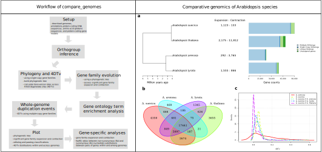

# compare_genomes: a comparative genomics workflow

Comparative genomics papers seldomly fully disclose their comparative genomics workflow. This hinders reproducibility and transferability of novel methods. To address this issue, we use [Nextflow](https://www.nextflow.io/) and [Conda](https://docs.conda.io/en/latest/) to improve the transferability of our lab group's comparative genomics workflow which has been used to assess the reference genome assembly of [*Lolium rigidum*](https://doi.org/10.3389/fgene.2022.1012694) and a new genome assembly of [*Salvia hispanica*](https://www.ncbi.nlm.nih.gov/data-hub/genome/GCF_023119035.1/).

## Installation

1. Download [compare_genomes](https://github.com/jeffersonfparil/compare_genomes.git) repository
```shell
git clone https://github.com/jeffersonfparil/compare_genomes.git
```

2. Install conda
```shell
wget https://repo.anaconda.com/miniconda/Miniconda3-latest-Linux-x86_64.sh
sh ./Miniconda3-latest-Linux-x86_64.sh
```

3. **Log out of the current session, then log back in** to finish conda setup.

4. Import and activate [compare_genomes conda environment](compare_genomes.yml)
```shell
conda env create -n compare_genomes --file compare_genomes/compare_genomes.yml
conda activate compare_genomes
```

## Quickstart

Run the example pipeline:
```shell
cd compare_genomes
nano config/params.config # replace dir = '/data-weedomics-3/TEST_PSEUDOMONAS' with a valid path in your machine
chmod +x run.sh
time ./run.sh
```

## Setup parameters

Set up the parameters for the comparative genomics analysis. You will find the following files in [`compare_genomes/config`](config/) folder (**Note**: you will need to include at least 3 species for gene family contraction and expansion analysis to work).

1. [`urls.txt`](config/urls.txt): links to the genome sequence, genome annotation, coding DNA sequence, and amino acid sequences for at least 3 species you wish to include in the analyses.
    - Formatted as headerless, two-columned, comma-separated file
    - Column 1: filename of the genome sequence, genome annotation, coding DNA sequence, and amino acid sequences (**Note**: the species names and extension names should be the consistent across these files, e.g. `*.fna` for the genomes, `*.gff` for the annotations, `*.cds` for the coding DNA sequences, and `*.faa` for the amino acid sequences)
    - Column 2: URL (uniform resource locator) of the zipped (*.gz or *.zip) or unzipped files for download

2. [`dates.txt`](config/dates.txt): pairwise divergence times between the species you wish to include in the analyses (e.g. look up dvergence times from [http://timetree.org/](http://timetree.org/)).
    - Formatted as headerless, two-columned, tab-delimited file
    - Column 1: two species separated by a comma with the same names used in the [`urls.txt`](config/urls.txt)
    - Column 2: time in million years, e.g. -160 for 160 million years ago

3. [`comparisons_4DTv.txt`](config/comparisons_4DTv.txt): list of species and pairs of species you wish to include in the estimation of transversion rates among 4-fold degenerate sites (4DTv). This statistic is used as a biological clock, where more mutations at the third codon position means more time has passed between a pair of sequences within and among species (Note: uses 2-copy genes for the estimation of 4DTv).
    - Formatted as headerless, one-columned file
    - Column 1: Species and pairs of species which should be the same names as in [`urls.txt`](config/urls.txt) but with underscores ("_") replaced with spaces (" "), and species pairs are written for example as "Zea mays X Oryza sativa".

4. [`genes.txt`](config/genes.txt): links to the gene sequences you wish assess expansion/contraction, and non-synonymous/synonynomous mutation (Ka/Ks) rates between pairs of sequences within and among species.
    - Formatted as headerless, three-columned, comma-separated file
    - Column 1: non-critical information: phenotype name or some identifying name
    - Column 2: non-critical information: species name which may be any species even ones not included in the analyses
    - Column 3: URL of the genes for download

5. [`params.config`](config/params.config): configuration file listing the variables specific to the analyses you wish to perform.
    - **dir**: output directory.
    - **species_of_interest**: the focal species of interest which should be the same as in [`urls.txt`](config/urls.txt), [`dates.txt`](config/dates.txt), and [`genes.txt`](config/genes.txt).
    - **species_of_interest_panther_HMM_for_gene_names_url**: URL to the specific Panther HMM database to extract gene names from, preferrably from the same species which will be used for gene ontology (GO) term enrichment analysis. See the current release list [here](http://data.pantherdb.org/ftp/sequence_classifications/current_release/PANTHER_Sequence_Classification_files/).
    - **urls**: location of [`urls.txt`](config/urls.txt).
    - **dates**: location of [`dates.txt`](config/dates.txt).
    - **comparisons_4DTv**: location of [`comparisons_4DTv.txt`](config/comparisons_4DTv.txt).
    - **genes**: location of [`genes.txt`](config/genes.txt).
    - **cafe5_n_gamma_cats**: number of the gamma values (parameter of the substittion model) to use for the assessment of significant gene family expansion and contraction using CAFE5. If this is equal to one, then we use the substitution model without the gamma function.
    - **cafe5_pvalue**: signifcance threshold of gene family expansion and contraction.
    - **go_term_enrich_genome_id**: genome ID for the species specified in **species_of_interest_panther_HMM_for_gene_names_url** or any species you wish to use. Find the appropriate taxon ID from [`here`](http://pantherdb.org/services/oai/pantherdb/supportedgenomes).
    - **go_term_enrich_annotation_id**: code for the gene ontology level you with to use, e.g. `GO:0008150` for "Biological Process". See the list of GO codes [`here`](http://pantherdb.org/services/oai/pantherdb/supportedannotdatasets).
    - **go_term_enrich_test**: GO term enrichment test to perform which can be either `FISHER` (Fisher's Exact Test) or `BINOMIAL`" (binomial distribution test).
    - **go_term_enrich_correction**: multiple testing correction which can be `NONE`, `FDR` (False discovery rate), or `BONFERRONI` (Bonferroni correction).
    - **go_term_enrich_ngenes_per_test**: number of randomly sampled genes to include in each GO term enrichment analysis.
    - **go_term_enrich_ntests**: number GO term enrichment analyses to perform.

6. [`process.config`](config/process.config): the second and last cofiguration file listing the computing resource allocation availble to you. Assign the number of **cpus** and **memory** capacity to use for low and high resources intensive tasks:
    - **LOW_MEM_LOW_CPU**
    - **HIGH_MEM_HIGH_CPU**

## Run

Once the parameters for your specific comparative genomics analysis are set up, you can run the entire workflow in one go, or you may wish to run each module separately.

1. Run the entire workflow
```shell
cd compare_genomes
chmod +x run.sh
./run.sh
```

2. Run each module individually but this needs to be in order as each module depends on the output of the previous one. Run these if you wish to troubleshoot and/or modify the workflow for analyses not implemented here, e.g. add a GO term enrichment analysis for significantly contracted gene families.
```shell
cd compare_genomes
nextflow run modules/setup.nf                               -c config/params.config ### SETUP
nextflow run modules/orthofinder.nf                         -c config/params.config ### DETERMINE ORTHOGROUPS
nextflow run modules/single_gene_orthogroups_tree.nf        -c config/params.config ### BUILD A PHYLOGENETIC TREE USING SINGLE-COPY GENE FAMILIES
nextflow run modules/single_gene_orthogroups_4DTv.nf        -c config/params.config ### COMPUTE THE TRANSVERSION RATES AMONNG 4-FOLD DEGENERATE SITES (4DTv)
nextflow run modules/gene_family_contraction_expansion.nf   -c config/params.config ### ASSESS SIGNIFICANT GENE FAMILY CONTRACTION AND EXPANSION (This may take days depending on your machine, number of species, and proteome sizes)
nextflow run modules/GO_enrichment.nf                       -c config/params.config ### GENE ONTOLOGY TERM ENRICHMENT ANALYSIS OF SIGNIFICANTLY EXPANDED GENE FAMILIES
nextflow run modules/assess_WGD.nf                          -c config/params.config ### ASSESS WHOLE GENOME DUPLICATION EVENTS
nextflow run modules/plot_tree_conex_venn_4DTv.nf           -c config/params.config ### PLOT THE PHYLOGENETIC TREE, CONTRACTION/EXPANSION, GENE SETS VENN DIAGRAM AND 4DTv
nextflow run modules/assess_specific_genes.nf               -c config/params.config ### ASSESS CONTRACTION/EXPANSION AND NON-SYNONYMOUS TO SYNONYMOUS NUCLEOTIDE SUBSTITION RATIOS
```
3. Workflow and example output plot



## Bioinformatics tools
- **OrthoFinder**: Emms, David M., and Steven Kelly. “OrthoFinder: Phylogenetic Orthology Inference for Comparative Genomics.” Genome Biology 20, no. 1 (November 14, 2019): 238. https://doi.org/10.1186/s13059-019-1832-y.was 
- **HMMER**: Mistry, Jaina, Robert D. Finn, Sean R. Eddy, Alex Bateman, and Marco Punta. “Challenges in Homology Search: HMMER3 and Convergent Evolution of Coiled-Coil Regions.” Nucleic Acids Research 41, no. 12 (July 1, 2013): e121. https://doi.org/10.1093/nar/gkt263.
- **PantherHMM gene family models**: Mi, Huaiyu, Anushya Muruganujan, Dustin Ebert, Xiaosong Huang, and Paul D Thomas. “PANTHER Version 14: More Genomes, a New PANTHER GO-Slim and Improvements in Enrichment Analysis Tools.” Nucleic Acids Research 47, no. D1 (January 8, 2019): D419–26. https://doi.org/10.1093/nar/gky1038.
- **MACSE**: Ranwez, Vincent, Sébastien Harispe, Frédéric Delsuc, and Emmanuel J. P. Douzery. “MACSE: Multiple Alignment of Coding SEquences Accounting for Frameshifts and Stop Codons.” PLOS ONE 6, no. 9 (September 16, 2011): e22594.
- **IQ-TREE**: Minh, Bui Quang, Heiko A Schmidt, Olga Chernomor, Dominik Schrempf, Michael D Woodhams, Arndt von Haeseler, and Robert Lanfear. “IQ-TREE 2: New Models and Efficient Methods for Phylogenetic Inference in the Genomic Era.” Molecular Biology and Evolution 37, no. 5 (May 1, 2020): 1530–34. https://doi.org/10.1093/molbev/msaa015.
- **ModelFinder (module of IQ-TREE)**: Kalyaanamoorthy, Subha, Minh, Bui Quang, Wong, Thomas KF, von Haeseler, Arndt, and Jermiin, Lars S. ”ModelFinder: Fast model selection for accurate phylogenetic estimates.” Nature Methods, 14 (2017):587–589. https://doi.org/10.1038/nmeth.4285
- **CAFE v5**: De Bie, Tijl, Nello Cristianini, Jeffery P. Demuth, and Matthew W. Hahn. “CAFE: A Computational Tool for the Study of Gene Family Evolution.” Bioinformatics 22, no. 10 (May 15, 2006): 1269–71. https://doi.org/10.1093/bioinformatics/btl097.
- **Gene ontology (GO) enrichment analysis**: Mi, Huaiyu, Anushya Muruganujan, Dustin Ebert, Xiaosong Huang, and Paul D Thomas. “PANTHER Version 14: More Genomes, a New PANTHER GO-Slim and Improvements in Enrichment Analysis Tools.” Nucleic Acids Research 47, no. D1 (January 8, 2019): D419–26. https://doi.org/10.1093/nar/gky1038.
- **KaKs_calculator v2**: Wang, Da-Peng, Hao-Lei Wan, Song Zhang, and Jun Yu. “γ-MYN: A New Algorithm for Estimating Ka and Ks with Consideration of Variable Substitution Rates.” Biology Direct 4, no. 1 (June 16, 2009): 20. https://doi.org/10.1186/1745-6150-4-20.
